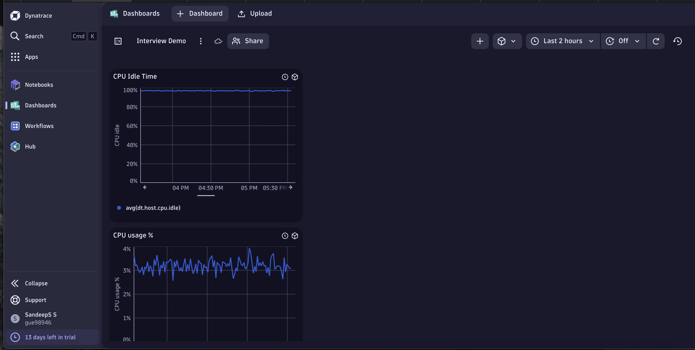

# Dynatrace Basics

This document provides a basic overview of Dynatrace, a powerful software intelligence platform for monitoring and optimizing application performance, infrastructure, and user experience.

[Visit Dynatrace Dashboard I have created for demo](https://gue98946.apps.dynatrace.com/ui/document/v0/#share=335974e9-f073-4fa8-b121-f3fccaf3f939)

Below is a screenshot of the dashboard I created in Dynatrace, showing metrics like CPU Idle Time and CPU Usage % .





## 🚀 What is Dynatrace?

Dynatrace is an all-in-one monitoring solution that uses AI and automation to provide observability across:
- Applications
- Infrastructure (cloud, on-prem, hybrid)
- Networks
- User experience
- Logs and events


## 🧩 Key Components

### 1. **OneAgent**
- Installed on hosts or containers.
- Automatically discovers applications, services, and processes.
- Captures metrics, traces, logs, and more.

### 2. **Dynatrace Platform / SaaS**
- Cloud-native monitoring dashboard.
- Provides AI-powered root cause analysis (Davis AI).
- Centralized configuration and analysis tool.

### 3. **Smartscape**
- A real-time topology map showing relationships between applications, services, processes, and hosts.

### 4. **Davis AI**
- Automatic root cause analysis.
- Provides answers, not just data.

## 🔧 Installation (Basic OneAgent Setup on Linux)

```bash
wget -O Dynatrace-OneAgent.sh "<download-link>"
sudo /bin/sh Dynatrace-OneAgent.sh
```

## 👉 *[Click here to know more about end-to-end integration with Dynatrace](./EC2%20+%20Dynatrace%20OneAgent%20Monitoring%20Setup.md)*


